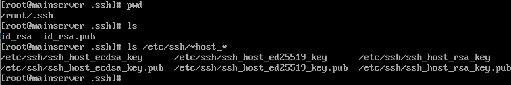

# difference-about-etcssh-and-tilde-dotssh
What difference about `/etc/ssh` and `/root/.ssh`, `/home/user/.ssh`?

## reference
1. https://unix.stackexchange.com/questions/439467/what-is-the-difference-between-etc-ssh-and-ssh

>Q: I’m having fun with OpenSSH, and I know the `/etc/ssh` directory is for the ssh daemon and the `~/.ssh` directory is for a particular user.
>
>Both directories contain private and public keys:
>
>
>But what is the difference between those keys? I’m confused because the ones I use as a user is in my home directory, and what are the roles of the keys found in `/etc/ssh`?

>A1: `/etc/ssh` provides configuration for the system: default configuration for users (`/etc/ssh/ssh_config`), and configuration for the daemon (/etc/ssh/sshd_config). The various host files in `/etc/ssh` are used by the daemon: they contain the host keys, which are used to identify the server — in the same way that users are identified by key pairs (stored in their home directory), servers are also identified by key pairs. Multiple key pairs are used because servers typically offer multiple types of keys: RSA, ECDSA, and Ed25519 in your case. (Users can also have multiple keys.)
>
>The various key files are used as follows:
>
> - your private key, if any, is used to identify you to any server you’re connecting to (it must then match the public key stored in the server’s authorized keys for the account you’re trying to connect to);
>
> - the server’s private key is used by the client to identify the server; such identities are stored in `~/.ssh/known_hosts`, and if a server’s key changes, SSH will complain about it and disable certain features to mitigate man-in-the-middle attacks;
>
> - your public key file stores the string you need to copy to remote servers (in `~/.ssh/authorized_keys`); it isn’t used directly;
>
> - the server’s public key files store strings you can copy to your known hosts list to pre-populate it; it also isn’t used directly.
>
>The last part isn’t used all that often; the default SSH model is known as “TOFU” (trust on first use): a connection is trusted by default the first time it’s used, and SSH only cares about unexpected changes. In some cases though it’s useful to be able to trust the first connection too: a server’s operator can communicate the server’s public keys, and users can add these to their known hosts before the first connection.
>
>See the `ssh_config` and `sshd_config` manpages for details (`man ssh_config` and `man sshd_config` on your system). The format used for known hosts is described in the sshd manpage.
